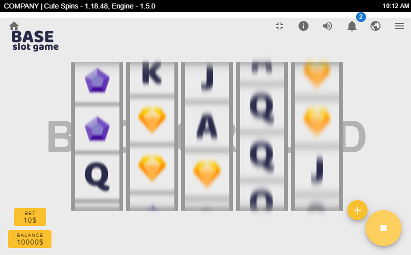

# Base Slot Game

> **Base Slot Game** is a base video slot game. Can be used to create a video slot game. Its using spine for animations and pixi for rendering. The code is structured & organized to be open for extension.



## Built with

- Node v10.16.0
- Yarn 1.19.2
- Npm 6.9.0
- Typescript
- Spine
- Pixi.js
- XState
- Babel
- Webpack

## Getting started

To get a local copy up and running follow these simple example steps.

### Install

```sh
$ yarn
```

### Build Development

```sh
$ yarn build
```

or

```sh
$ yarn watch
```

## Usage

```sh
$ yarn serve
```

**Open http://localhost:8080 in browser and click on dist/ directory**

## Future changes

- Improve usability
- Audio

## Contact

For contact, you can reach me at [marjantanevski@outlook.com](marjantanevski@outlook.com).

## License

MIT © [Marjan Tanevski](marjantanevski@outlook.com)
